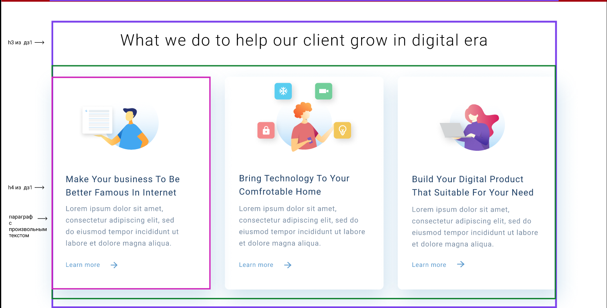

# Разбиение сайта на блоки.

1. Предоставляется изображение сайта:

На нём разными цветами выделены блоки, на которые требуется разбить страницу. Верстать по макету не нужно, просто добавить элементы div c class, которые выделены на изображении.

3. Всё содержимое 3 дз вам необходимо добавить в блоки, отмеченные на изображении сайта.
4. Никаких новых элементов из макета добавлять не нужно. Вы начнёте работать с ним на 6 уроке.
5. Всем блокам необходимо задать логичное название класса, запрещается использовать перечисление (`block1`, `block2`, `block3. . . block378`)
6. *Для страницы "Контакты" также представлено изображение страницы только без разбиения на блоки. Тут вам необходимо самостоятельно разделить ваш сайт на блоки.

Задания со * являются дополнительными, его выполнять не обязательно