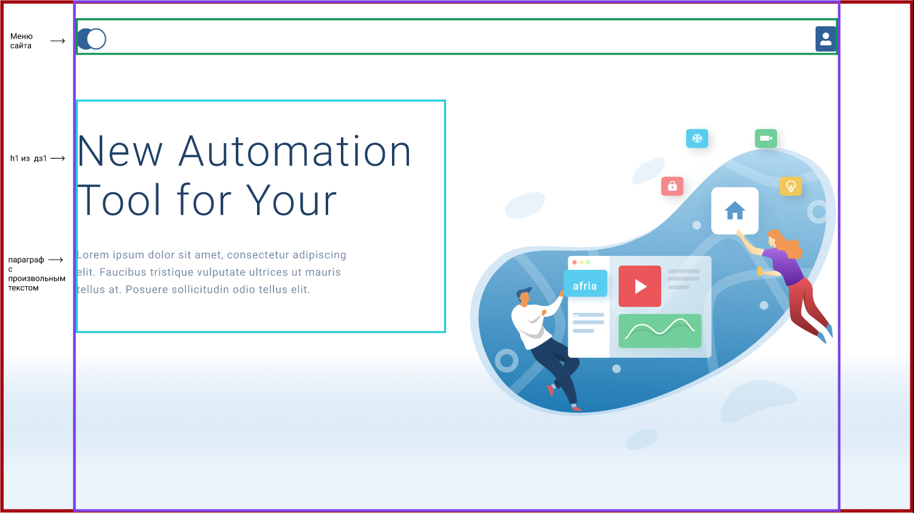
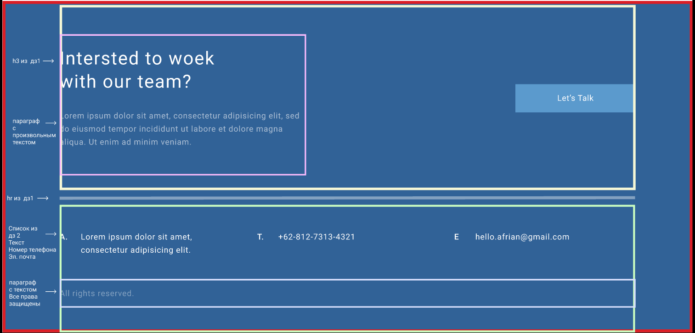
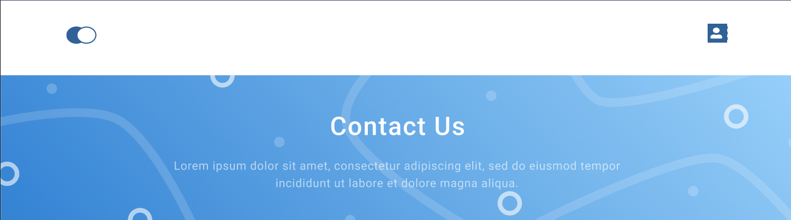
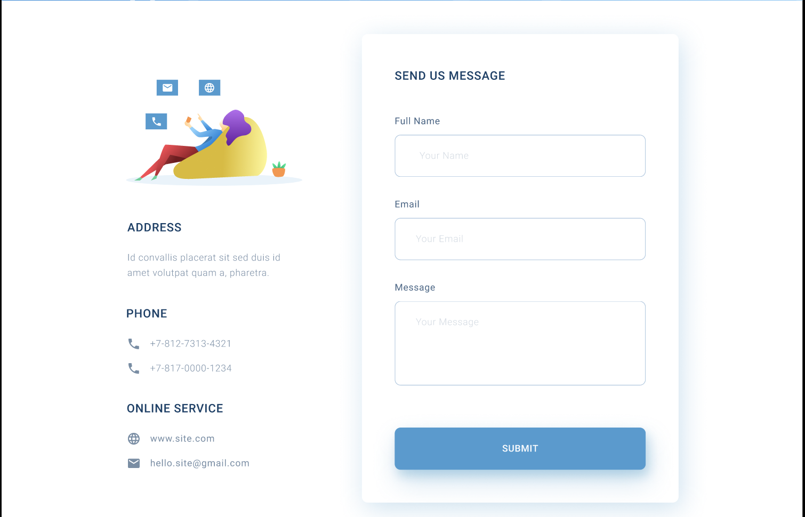

1. В файле стилей первой строчкой добавить обнуление стилей:

```css
* {
  margin: 0;
  padding: 0;
}
```

2. В файле стилей создать блок container, отвечающий за центрирование нашей страницы:

```css
.container {
  width: 1140px;
  margin: 0 auto;
}
```

3. В шапке сайта необходимо расположить элементы горизонтально, текст «Главная» должен располагаться слева, «Контакты» — справа.

4. Заголовку h1 указать ширину 510px.

5. Тексту под заголовком h1 указать ширину 425px.

6. В HTML-файле class=”what-we-do” добавить класс container, чтобы получилось class=”what-we-do container” для центрирования содержимого блока what-we-do.
   1. Блоку карточки (заголовок h4: Make your business, смотри макет ниже и p) указать значение ширины 359px.

   2. Создать ещё 2 карточки товара, как представлено в изображении макета. Итого получится 3 карточки.

      
      
      
      
      

   3. Расположить их горизонтально и выставить равные отступы между ними.

7. В подвале сайта:

   1. Добавить центрирование всего контента. В подвале сайта, внутри блока footer, создать блок container для центрирования содержимого. Должна получиться структура

      ```html
      <div class=”footer”>
      <div class=”container”>Содержимое футера</div>
      </div>
      ```

    2. Блоку контента (h4 “Intersted to woek” и p), в верхней части футера указать ширину 495px;
    3. Заголовку в подвале сайта указать ширину 340px.
    4. Список в нижней части подвала (номер телефона и email) расположить горизонтально и выставить равные отступы между ними.

8. Страница «Контакты»:

    1. Добавить центрирование всей контентной части страницы с помощью блока container.
    
    2. В соответствии с изображением страницы «Контакты» разместить слева блок с контактами, справа — блок формы заполнения данных.
    
    3. Карту сайта сделать на всю ширину container.
    
       
       
       
       
    
    

