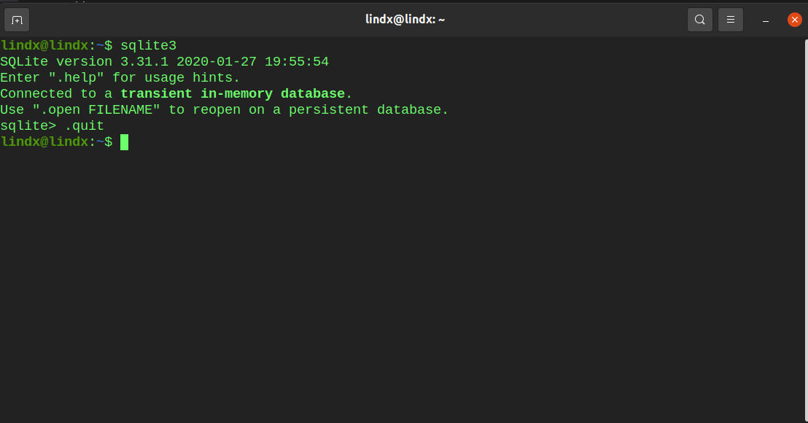

# 1. Привести данные по преподавателям к третьей нормальной форме.

_**Дополнительные пояснения к данным:**_

- _нумерация потоков сквозная;_
- _поток определяет прохождение определённого курса некоторой группой учеников;_
- _следующий курс для группы пойдёт уже другим потоком;_
- _один ученик может закончить несколько курсов (потоков);_
- _один преподаватель может вести разные курсы;_
- _успеваемость учеников - оценка, выставленная преподавателем группе в целом по итогам выполнения проекта, также отражает вовлечённость группы в учебный процесс._

| **Преподаватель** | **Электронная почта**    | **Курс**               | **Номер потока** | **Дата начала обучения** | **Количество учеников** | **Успеваемость** **учеников** |
| ----------------- | ------------------------ | ---------------------- | ---------------- | ------------------------ | ----------------------- | ----------------------------- |
| Савельев Николай  | <saveliev.n@mai.ru>      | Базы данных            | 203              | 12.11.2020               | 35                      | 4.8                           |
| Петрова Наталья   | <petrova.n@yandex.ru>    | Основы Python          | 178              | 02.10.2020               | 37                      | 4.9                           |
| Малышева Елена    | <malisheva.e@google.com> | Linux. Рабочая станция | 165              | 18.08.2020               | 34                      | 4.7                           |
| Савельев Николай  | <saveliev.n@mai.ru>      | Базы данных            | 210              | 03.12.2020               | 34                      | 4.9                           |

> В качестве отчёта необходимо сдать таблицы с соответствующим содержимым в формате PDF. Рекомендуется выполнить это задание в программе, предназначенной для работы с таблицами (Microsoft Excel, Open Office Calc или другой, зависит от вашей рабочей системы), и затем выполнить экспорт результата в файл формата PDF. Если такой программы у вас нет, можно создать таблицы с помощью сервиса Google Docs или в любом текстовом редакторе.

## <u>**Solution:**</u>

<u>table: **group**</u>

> успеваемость учеников - оценка, выставленная преподавателем группе в целом по итогам выполнения проекта, также отражает вовлечённость группы в учебный процесс.

| id   | number | date_of_start | performance |
| ---- | ------ | ------------- | ----------- |
| 1    | 203    | 12.11.2020    | 4.8         |
| 2    | 178    | 02.10.2020    | 4.9         |
| 3    | 165    | 18.08.2020    | 4.7         |
| 4    | 210    | 03.12.2020    | 4.9         |

<u>table: **course**</u>

| id   | name                   |
| ---- | ---------------------- |
| 1    | Базы данных            |
| 2    | Основы Python          |
| 3    | Linux. Рабочая станция |

<u>table: **course_group**</u>

> поток определяет прохождение определённого курса некоторой группой учеников;

| id   | group_id | course_id |
| ---- | -------- | --------- |
| 1    | 1        | 1         |
| 2    | 2        | 1         |
| 3    | 3        | 3         |
| 4    | 4        | 4         |

<u>table: **student**</u>

> один ученик может закончить несколько курсов (потоков);

| id   | student_id | course_id | group_id |
| ---- | ---------- | --------- | -------- |
| 1    | 1          | 1         | 1        |
| 1    | 2          | 2         | 2        |
| 3    | 2          | 3         | 4        |

<u>table: **teacher**</u>

> один преподаватель может вести разные курсы

| id   | firstname | lastname | email                  |
| ---- | --------- | -------- | ---------------------- |
| 1    | Николай   | Савельев | saveliev.n@mai.ru      |
| 2    | Наталья   | Петрова  | petrova.n@yandex.ru    |
| 3    | Елена     | Малышева | malisheva.e@google.com |

<u>table: **teacher_courses**</u>

| id   | teacher_id | course_id |
| ---- | ---------- | --------- |
| 1    | 1          | 1         |
| 2    | 1          | 2         |
| 3    | 2          | 3         |

# 2. Установите программу sqlite3

Установите программу sqlite3, запустите её, выйдите командой .quit (точка плюс quit). В качестве отчёта сдайте скриншот результата выполнения.

