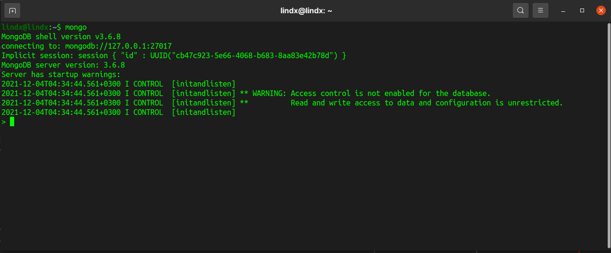
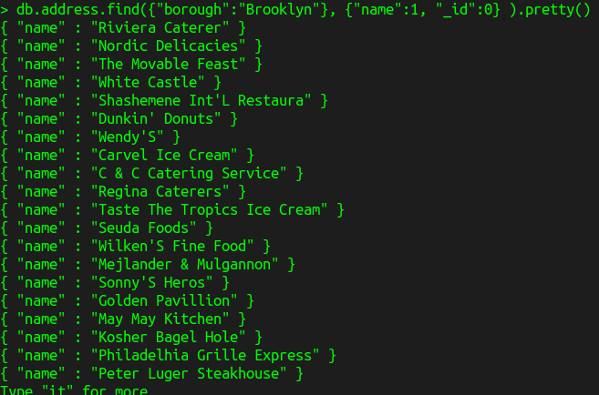
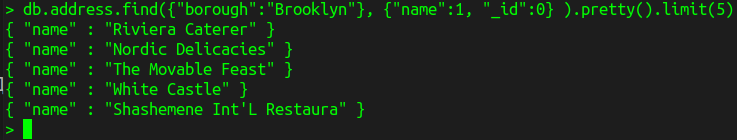

# Масштабирование MySQL и NoSQL

1. Установить и запустить MongoDB.

   

   

2. Импортировать файл [primer-dataset.json](zip/primer-dataset.zip)

   [db-hw-01.json](db-01.json)

3. Найти в получившейся коллекции рестораны, расположенные в Бруклине 
   
```bash
("borough" : "Brooklyn")
```
   - вытащить только их названия (поле "name")



[db-02.json](db-02.json)

> Сдать нужно скрипт задания 3 и принтскрин его выполнения (можно только первые несколько значений)



