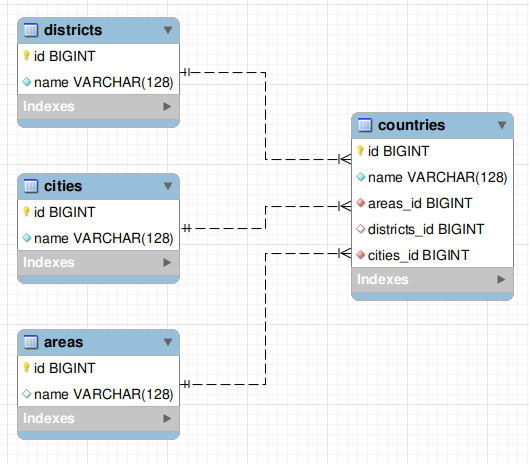
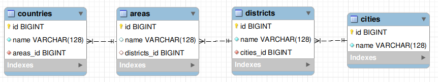

# Lesson 01. Проектирование реляционной базы данных

## 1. Установить MySQL сервер и MySQL Workbench.

## 2. Создать базу данных «Страны и города мира» с помощью MySQL Workbench. 

- Схема будет такой:

  страна ➝ область ➝ район (если есть) ➝ населенный пункт (город/село/деревня/…).

> Нужно сдать скрипты создания объектов (файл .sql) и ER-диаграмму (файл .mwb). Файлы упаковать в архив.

### ver 01 - [Страны и города мира.sql](db-ver-01.sql)

- [Страны и города мира-ver02.mwb](mwb/countries_and_cities_of_the_world-ver01.mwb)

  
  

### ver 02 - [Страны и города мира.sql](db-ver-02.sql)

- [Страны и города мира-ver02.mwb](mwb/countries_and_cities_of_the_world-ver02.mwb)

# [Lesson_001.zip](Lesson_001.zip)